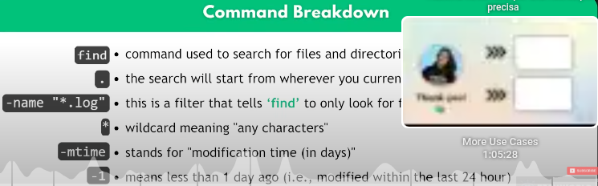

# **LINUX**

**Struttura del file system Linux spiegata: da / a /usr | Nozioni di base su Linux**

[x]  https://www.youtube.com/watch?v=ISJ44S5sZu8&list=PLmQB6ao4XoI9S4cIKIRsLQKDHhBPesSQ5&index=9

**Bash Scripting Tutorial for Beginners**

[ ]  https://www.youtube.com/watch?v=PNhq_4d-5ek&list=PLy7NrYWoggjzDAxOxWazuVSsndW3fUinz

**what is shall? what is bash?**

- CLI => a way to interapt with computer by writing commands
- in Linux CLI is SHELL
- BASH => Bourn-Again Shell (most common shell) is not only a shell but it's a programming language
- bash scripts 

- grep -c "ERR" application.log

- -c the count of ...
- find . -name "*.log" -mtime -1
- trova nella cartella attuale i file .log che sono stati modificati nell'ultimo giorno

**13 Linux Commands Every Engineer Should Know (Real-World Example)**

[x]  https://www.youtube.com/watch?v=CLh2ACdXNbc&list=PLy7NrYWoggjzDAxOxWazuVSsndW3fUinz&index=3

