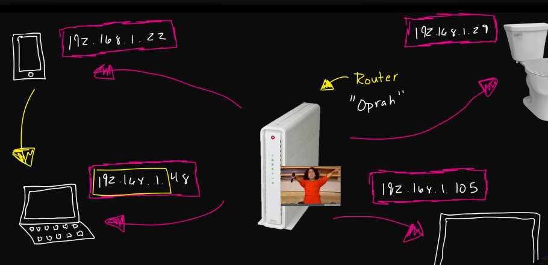
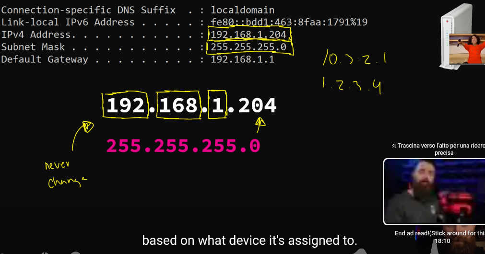
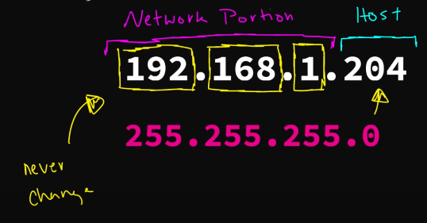

# **NETWORKING**

**what is an IP Address? // You SUCK at Subnetting // EP 1**

[x] https://www.youtube.com/watch?v=5WfiTHiU4x8

[ ] https://www.youtube.com/watch?v=tcae4TSSMo8

[ ] https://www.youtube.com/watch?v=8bhvn9tQk8o

- ip address like a phone number to identify devices. 192.168.1.204
**MR. SUBNET MASK aka NETMASK**
Tells what ip addresses start with. he tells the street we live on.. 
- subnet aka netmask 255.255.255.0

**MR. DEFAULT GATEWAY aka ROUTER**
He does it all. give ip addresses to our devices in our network and could help us to get outside our network. if you wanna visit netflix for instance.

- default gateway aka router aka default router 192.168.1.1
- router (by DHCP) gives your devices an IP address

- device is a HOST
- host number can change. but the network portion don't
  

- if my computer wants to call netflix (another ip address not in his neighborhood) needs "ups" aka default gateway aka router. he knows everything related others ip address.

- whenever any device in a network (home network or     business network etc...)  wants to talk to something outside it's network it has to talk to it's router. it's default gateway to get out.

**UNtouchable IP address**
- 192.168.1.0 -> network address
- 192.168.1.255 -> broadcast address
- and that one associated to the default gateway aka router (for example: 192.168.1.1)

so from 0 to 255 = 256 ip addresses and you can use just 253

