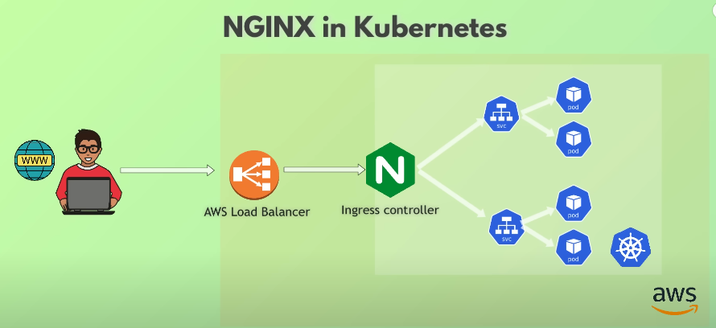
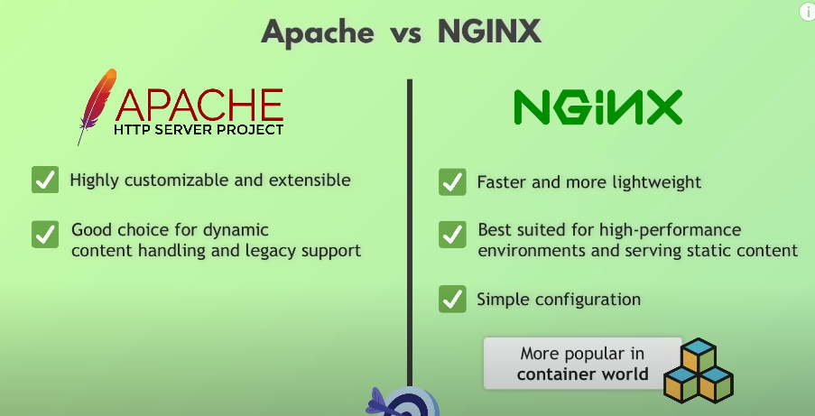

# **NGINX**

**NGINX Explained - What is Nginx**
[x]  https://www.youtube.com/watch?v=iInUBOVeBCc&t=484s

- NGINX = piece of software on a server that handles HTTP requests.
- NGINX once when internet was easy was only a high performance webserver but now with millions of http requests can also act as a load balancer: distributes incoming traffic acrosso multiple backend servers (with others nginx)
- PROXY = Acting on behalf of another, proxy server: intermediaty servers that forwards client requests to other servers with the fewest active connections.
- NGINX configurations….
- NGINX in KUBERNETES: nginx as K8S Ingress Controller→ essentially a proxy , specialized load balancer for managing ingress (incoming) traffic in kubernetes.
- perché se già i cloud platform come AWS hanno i loro load balancer, dovremmo usare nginx? perché lavorano insieme.
    - NGINX ingress controller act as load balancer inside the k8s cluster. Not public accessibile.
    - while the cloud load balancer (AWS ELB) is accessibile from public.
    - super security! so the cluster is never directly exposed to public access
        
        

**NGINX VS APACHE web server**

are pretty much the same thing. 

# **IT FUNDAMENTALS:**
- [ ]  https://www.youtube.com/playlist?list=PLy7NrYWoggjzDAxOxWazuVSsndW3fUinz