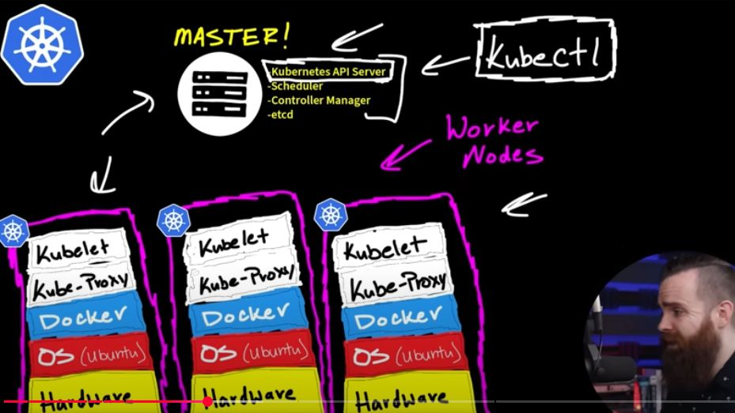
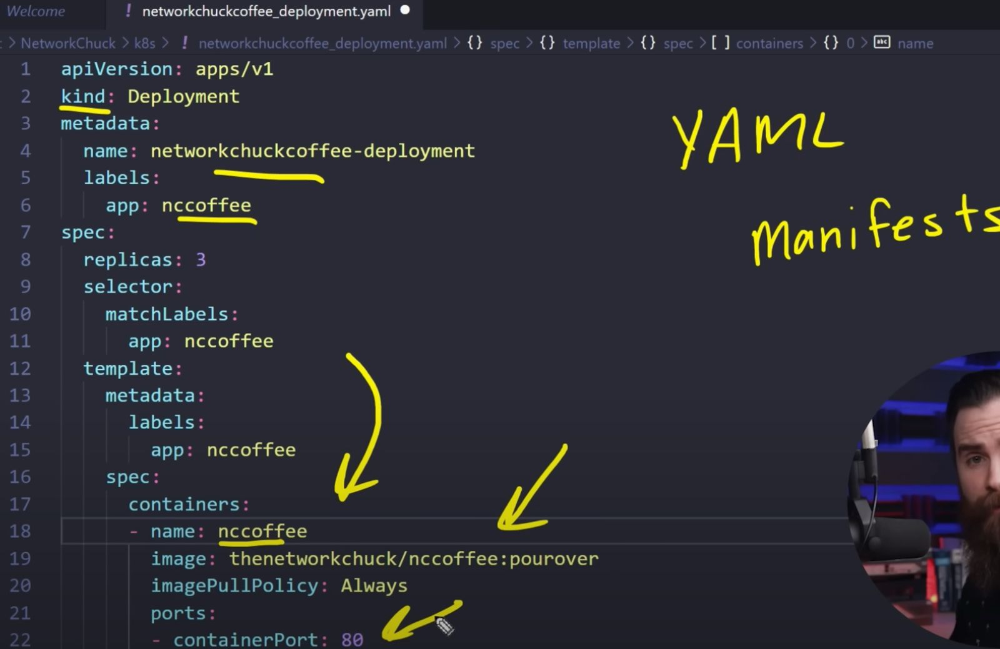
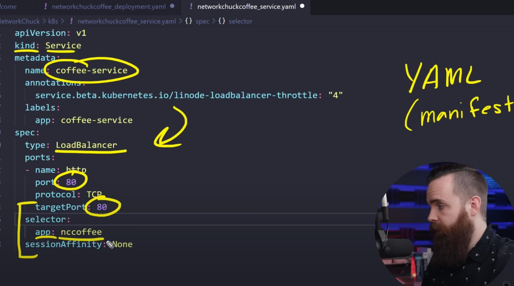

# Kubernetes

**Cluster**

- Cluster = l’intero datacenter Kubernetes
- Cos’è il cluster EKS:  composto da Control plane + Worker nodes

*Control plane:* API server, scheduler, controller manager, etcd. In EKS è gestito da AWS. Non c’è un tuo “master node” su EC2.

*Worker nodes:* le istanze dove girano i Pod. Sono EC2 (providerID AWS), pronte, v1.33.4-eks-…

- Comando utile: kubectl get nodes -o wide

**Namespace**
- Namespace = “stanze” dentro quel datacenter. Più namespace convivono nello stesso cluster.

L’isolamento è solo logico: per isolare rete serve NetworkPolicy.

Quote/limiti si applicano a livello di namespace, non di cluster.

Cos’è un namespace

Partizione logica dentro un singolo cluster.

Contiene risorse “namespaced” (Pod, Service, Deployment, ConfigMap, Secret, …).

Non contiene risorse “cluster-scoped” (Node, PersistentVolume, ClusterRole, CRD, …).

Serve per isolamento logico, quote/limiti, RBAC e naming.

Comandi tipici:

kubectl get ns

kubectl get pods -n <ns>

kubectl get all -n <ns>

**Deployment**

**Service**

**Worker Node**

in EKS un worker node tipicamente corrisponde a una istanza EC2.
- Ogni EC2 registrata al cluster = 1 nodo Kubernetes.
- I nodi stanno in node group (ASG o managed node groups).
- Alternative: con Fargate non gestisci EC2; i Pod girano su infrastruttura gestita e non amministri nodi.

Note utili:
- Un nodo può eseguire più Pod. Il limite dipende da vCPU/RAM e dai limiti Pod-per-nodo dell’istanza.
- Control plane EKS è separato e gestito da AWS, non è nelle tue EC2.

 

 

**Kubectl**

**multi-tenancy**
Condivisione di risorse: Invece che avere un'infrastruttura separata per ogni cliente, diversi tenant utilizzano la stessa istanza software, lo stesso sistema operativo e la stessa infrastruttura hardware sottostante

# ** 🧠 CPU vs Memoria in Kubernetes — spiegato facile **
Tipo risorsa	A cosa serve	Se sbagli cosa succede
CPU	Quante istruzioni può eseguire il container nel tempo → calcolo	Se è troppo poca: il pod viene rallentato (throttling), ma NON crasha
Memoria	Quanta RAM può usare per dati in uso, heap, cache ecc.	Se è troppa poca: il pod va in crash (OOMKilled)

🧠 Trucco per ricordare (con analogia semplice):
Immagina un cuoco (container) che cucina in una cucina (pod):

🔹 CPU = mani del cuoco

Più mani ha → più può lavorare in parallelo. Se ha solo 1 mano → lavora lentamente (throttling), ma non muore.

🔹 Memoria = tavolo da lavoro (RAM)

Se il tavolo è troppo piccolo e non ci sta la roba → il piatto cade per terra → crash (OOMKilled).

CONSUMI RISORSE KUBE

Verifica richieste/limiti dichiarati nei Pod

kubectl get pod -n prov-ippv2-svts-platform-namespace -o=custom-columns='NAME:.metadata.name,CPU_REQUEST:.spec.containers[*].resources.requests.cpu,CPU_LIMIT:.spec.containers[*].resources.limits.cpu,MEM_REQUEST:.spec.containers[*].resources.requests.memory,MEM_LIMIT:.spec.containers[*].resources.limits.memory'

Oppure un esempio più leggibile (usa kubectl describe):

kubectl describe pod <POD_NAME> -n <NAMESPACE>

Passaggio successivo: verifica utilizzo effettivo
kubectl top pod -n prov-ippv2-svts-platform-namespace
