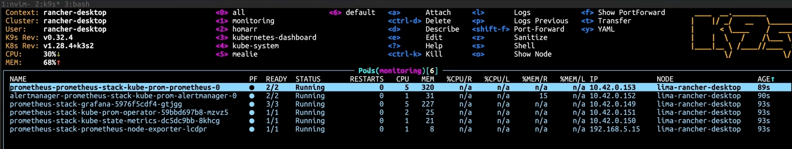

+++
title = "Kubernetes: misha CKA - monitoring"
date = 2025-12-30
draft = false
tags = ["kubernetes"]
+++


# Prometheus Monitoring Stack

```bash
helm install prometheus-stack prometheus-community/kube-prometheus-stack --namespace=monitoring --create=namespace

```
otteniamo:



## cosa è monitoring stack?
- m.s. is responsible for collecting metrics and visualize them

## what is a metric?
- m. a number used to assess the performance of a status or process
es. CPU è una metrics, or RAM

## Componenti Principali

**PROMETHEUS**
- Raccoglie e memorizza metriche (time-series database)
- Fa query sui dati con PromQL
- Pull-based: "chiede" metriche agli exporter

**GRAFANA**  
- Dashboard per visualizzare metriche
- Si connette a Prometheus come datasource
- Crea grafici, alert visivi, report

**ALERTMANAGER**
- Gestisce gli alert di Prometheus
- Invia notifiche (email, Slack, PagerDuty...)
- Raggruppa alert simili, evita spam

**PROMETHEUS OPERATOR**
- Semplifica gestione Prometheus via YAML
- Invece di config file complessi usi CRD Kubernetes
- Es: `ServiceMonitor`, `PrometheusRule` → YAML K8s standard

**KUBE-STATE-METRICS**
- Espone metriche sullo *stato* delle risorse K8s
- Es: "quanti pod sono Running?", "deployment pronto?"
- Chiama API Server → converte in metriche → Prometheus raccoglie

**NODE-EXPORTER**
- Espone metriche *hardware* dei nodi
- CPU, RAM, disco, network del server fisico
- Un pod per ogni nodo (DaemonSet)
```

## Flusso Completo
```
1. NODE-EXPORTER raccoglie CPU/RAM/disco del nodo
2. KUBE-STATE-METRICS raccoglie stato pod/deployment da API
3. PROMETHEUS fa scraping (pull) ogni 30s da exporter
4. Prometheus salva metriche in database interno
5. GRAFANA legge da Prometheus e mostra dashboard
6. ALERTMANAGER controlla regole e invia notifiche