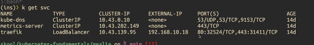

+++
title = "Kubernetes: misha CKA - networking"
date = 2025-12-28
draft = false
tags = ["kubernetes"]
+++
 

# NETWORKING 

PODS:
- each pod has its own IP Address
- every container has a own port on pod
- networking at pod level not container
- by default pods can connect to all pods on all nodes but it's best practice to set network policy / namespaces
- Can communicate each other through localhost -> - you can see pod as VM can have multiple containers, so they will be able to reach other through localhost (localhost=the machine you are on currently)


### how pods can connect to all pods on all nodes? 

because of CNI Plugin = Container Networking Interface. k8S Under the hood use CNI.

- imagine as the docker container has the physical NIC (network interface card) with a ethernet wire :)  
(use **ifconfig or ipconfig** to display MAC and other networking informations about your PC or VM)

- provides newtork connectivity to containers
- configures network interfaces in containers
- assign IP addresses and sets up routes -> IPTables on nodes

When you set up a CLuster from scratch you have to choose your own CNI plugin:
- CILIUM
- CALICO
- FLANNEL


## RancherDesktop:
RancherDesktop ha una sua CLI 
- "rdctl -h" = help
- rdctl shell bash => entri dentro la VM di rancher-desktop! come nelle macchine linux
- se vuoi vedere quale CNI is running in rancher desktop vai-> cd /etc/cni e vedrai FLANNEL


# SERVICES

## what problem solve? 
it's difficoult tracking all pods. you can have 1000 pods for 1 application right? 
non posso preoccuparmi di quale pod riceverà la request, ma il service riceve e la gira.
quindi punteremo l'app al service e il service will handle it
## why whe need  service?
- pods are ephemeral. because they update and scaling
- 
## Perché servono?
- I pod hanno IP dinamici (muoiono/ripartono)
- Un Service fornisce un IP stabile
- Fa load balancing tra i pod
- 
### il comando per generare rapidamente service è expose oppure meglio service.yaml:
ma ricorda: questo è solo per comprende il concetto. non si espone un service  a meno che non sia un database o altri casi particolari si usano gli *INGRESS*

```bash
cat deployment.yaml
apiVersion: apps/v1
kind: Deployment
metadata:
  labels:
    app: mealie
  name: mealie
spec:
  replicas: 1
  selector:
    matchLabels:
      app: mealie
  template:
    metadata:
      labels:
        app: mealie
    spec:
      containers:
        - image: ghcr.io/mealie-recipes/mealie:v3.8.0
          name: mealie
        
kubectl config set-context --current --namespace=mealie
Context "rancher-desktop" modified.

kubectl apply -f  deployment.yaml 
deployment.apps/mealie created


## Creare un Service

### Metodo rapido (imperativo)
kubectl expose deployment mealie --port 9000
service/mealie exposed

kubectl get service
NAME     TYPE        CLUSTER-IP      EXTERNAL-IP   PORT(S)    AGE
mealie   ClusterIP   10.43.160.246   <none>        9000/TCP   14s


### Metodo dichiarativo (consigliato) 
kubectl get service mealie -o yaml > service.yaml

cat service.yaml 
apiVersion: v1
kind: Service
metadata:
  creationTimestamp: "2025-12-28T20:47:40Z"
  labels:
    app: mealie
  name: mealie
  namespace: mealie
  resourceVersion: "16996"
  uid: 0af9bcab-2fac-4459-8df1-c3d163e981cb
spec:
  clusterIP: 10.43.160.246
  clusterIPs:
  - 10.43.160.246
  internalTrafficPolicy: Cluster
  ipFamilies:
  - IPv4
  ipFamilyPolicy: SingleStack
  ports:
  - port: 9000
    protocol: TCP
    targetPort: 9000
  selector:
    app: mealie
  sessionAffinity: None
  type: ClusterIP
status:
  loadBalancer: {}


```
recap possiamo expose il deployment tramite service
perché se expose il pod e poi kill the pod (is ephemeral) you lost connection

MA in questo modo in localhost non possiamo vederlo, per fare test locali possiamo fare il solito port forward:
```bash
kubectl port-forward services/mealie  9000
Forwarding from 127.0.0.1:9000 -> 9000
Forwarding from [::1]:9000 -> 9000
Handling connection for 9000
Handling connection for 9000
Handling connection for 9000

```
Qual è la differenza tra expose e creare service.yaml?

expose = crea il Service automaticamente
service.yaml = lo crei tu manualmente (più controllo)


## Posso accedere a ClusterIP da localhost?

No, solo con port-forward (temporaneo)
Per accesso reale usa NodePort o Ingress


## Tipi di Service

| Tipo | Visibilità | Quando usarlo |
|------|-----------|---------------|
| **ClusterIP** |default | Solo dentro il cluster | Microservizi interni | expose a port on each node allowing direct access to the service through any node's IP address
| **NodePort** | Porta su ogni nodo | Test locali |
| **LoadBalancer** | IP pubblico | Cloud (AWS, GCP) used for cloud providers. to route traffic into the cluster. (can also use it in k3s/rancher-desktop)


 ## Test del Service

### Da dentro il cluster
```bash
kubectl run test --image=curlimages/curl -it --rm -- sh
curl http://mealie.mealie.svc.cluster.local:9000
```

### Da localhost (solo per debug)
```bash
kubectl port-forward svc/mealie 9000:9000 -n mealie
# Vai su localhost:9000
```

**Attenzione**: port-forward NON è una soluzione per produzione!


# INGRESS

## Cos'è un Ingress?

Ingress exposes HTTP and HTTPS routes from outside the cluster to services within the cluster.
Ingress è una risorsa Kubernetes che permette di esporre applicazioni usando un dominio (FQDN) invece di un IP. Espone route HTTP/HTTPS dall'esterno del cluster verso i servizi interni.

**Problema:** Non possiamo dare IP e porta ai customer per accedere all'app.  
**Soluzione:** Usare un DNS (es. `www.pippo.it`) che punta all'Ingress.

---

## Features principali

- **SSL/TLS termination**: puoi avere un certificato SSL sul dominio. gestisce i certificati HTTPS
- **External URLs**: esponi l'app con un URL pubblico
- **Path-based routing**: 
  - Esempio: `pippo.it/app1` → Service A
  - Esempio: `pippo.it/app2` → Service B

---

## Ingress Controllers (scegli uno)

- **NGINX**
- **Traefik** (incluso in Rancher Desktop)
- **Cilium**
- Cloud provider: AWS ALB, GCP Ingress, Azure Application Gateway

---

## Come funziona il flusso

```
Browser: inserisci www.pippo.it
    ↓
DNS Provider (es. Cloudflare) risolve il dominio in un IP del Load Balancer
    ↓
LoadBalancer (creato da Traefik/NGINX) riceve la richiesta su porta 80/443
    ↓
Ingress Controller (legge le routing rules)
    ↓
Service (ClusterIP) riceve il traffico dall'Ingress
    ↓
Pod1 o Pod2
```

**In sintesi:** invece di usare IP address, usiamo URL grazie all'Ingress.

> **REMEMBER: URL = INGRESS!**

---

## Verifica Traefik su Rancher Desktop

```bash
# Vedi tutti i namespace
kubectl get pods -A

# Cerca il pod traefik in kube-system
kubectl get pods -n kube-system

# Verifica il Service LoadBalancer
kubectl get services -n kube-system
```

**Output atteso:**
```
NAME      TYPE           EXTERNAL-IP   PORT(S)
traefik   LoadBalancer   localhost     80:xxx/TCP,443:xxx/TCP
```



---

## Esempio di configurazione Ingress

```yaml
apiVersion: networking.k8s.io/v1
kind: Ingress
metadata:
  name: minimal-ingress
spec:
  ingressClassName: nginx  # oppure traefik
  rules:
    - host: www.pippo.it 
      http:
        paths:
        - path: /
          pathType: Prefix
          backend:
            service:
              name: test
              port:
                number: 80
```

**Cosa fa:**
- Richieste a `www.pippo.it/` → Service `test` porta 80


 