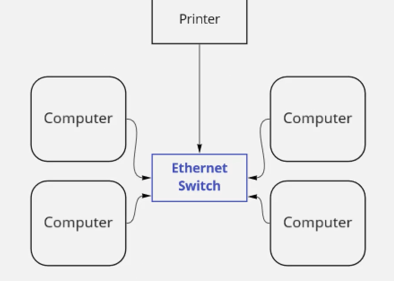
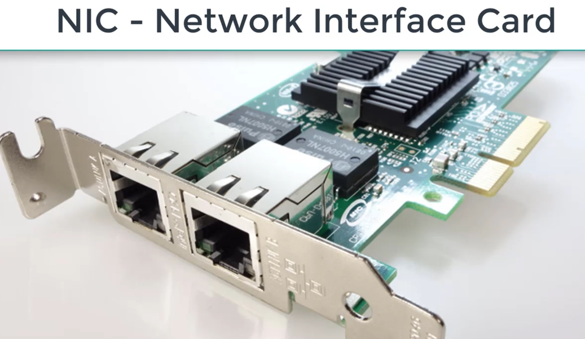
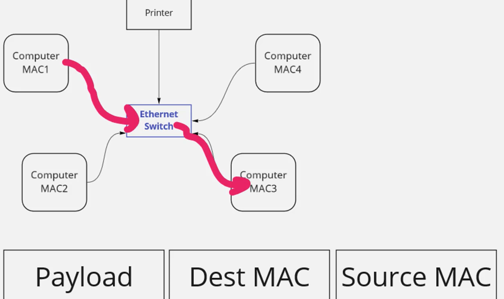

+++
title = "Networking: Beginner Crash Course
"
date = 2025-11-23
draft = false
tags = ["networking"]
+++

# *1.Introduction to Basic Networking Concepts*

- example of a basics LAN = Local Area Network 
- basically a physical location where we are connecting many devices togheter and we can use Ethernet to connect those devices to one another.
- Ethernet (or WIFI but would be a Wireless LAN) is used to connect LAN devices

- every NIC (network interface card) has a unique MAC address associated 
- use **ifconfig or ipconfig** to display MAC and other networking informations about your PC.

- when a computer mac1 wants to communicate with others the path is called ethernet frame
- addressig information on a ethernet frame

# *2.LAN: Local Area Networks, including Hubs, Bridges, and Switches*

*Collision Domain vs Broadcast Domain*