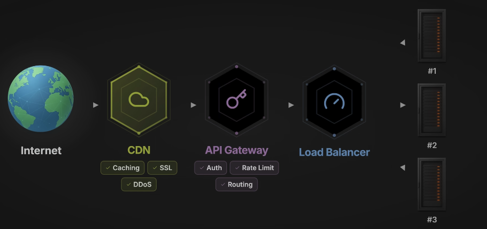
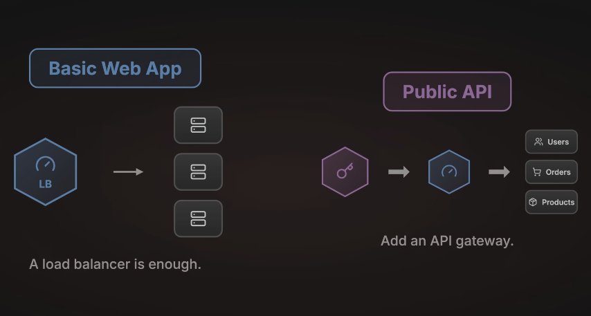

+++
title = "API Gateway, Load Balancer, Reverse Proxy"
date = 2026-02-10
draft = false
tags = ["nginx","loadbalancer","apigateway"]
+++
# API Gateway, Load Balancer, Reverse Proxy: Guida Completa

## Introduzione

API gateway, load balancer, reverse proxy. Se hai mai avuto la sensazione che questi termini vengano usati in modo intercambiabile, o hai annuito in una riunione senza capire davvero la differenza, sei in buona compagnia.

Tutti si posizionano tra client e server. Tutti inoltrano richieste. Ma esistono per ragioni diverse e risolvono problemi diversi.

Vediamo ciascuno di essi: cosa fa, quando ti serve, e come funzionano insieme nei sistemi reali.

---

## Reverse Proxy: Il Concetto Fondamentale

### Prima di tutto: cos'è un proxy normale?

Un **forward proxy** si posiziona davanti ai client. Un proxy web aziendale che filtra quali siti i dipendenti possono visitare, o un servizio per la privacy che maschera il tuo indirizzo IP — questi sono forward proxy. Aiutano i client a raggiungere i server, spesso aggiungendo un livello di controllo o anonimato.

### Il Reverse Proxy è l'opposto

Si posiziona **davanti ai server**. Quando fai una richiesta alla maggior parte dei servizi principali — Netflix, Stripe, GitHub — non stai parlando direttamente con i loro application server. Stai parlando con un reverse proxy.

Il flusso:
1. Riceve la tua richiesta
2. La inoltra al backend appropriato
3. Ottiene la risposta
4. Te la restituisce

Tu non vedi mai cosa c'è dietro.

### Perché aggiungere questo layer extra?

| Funzione | Beneficio |
|----------|-----------|
| **SSL Termination** | La crittografia HTTPS è CPU-intensive. Il proxy la gestisce, così i tuoi servizi backend non devono farlo |
| **Caching** | Memorizza le risposte richieste frequentemente. Mille utenti richiedono la stessa immagine? Servila dalla cache, non dal backend |
| **Security** | I tuoi server reali restano nascosti. Gli attaccanti vedono solo l'IP del proxy |
| **Compression** | Comprime le risposte con GZIP prima di inviarle sulla rete |

### Tool comuni
- NGINX
- HAProxy
- Caddy
- Apache

> Se hai mai configurato uno di questi davanti a un'applicazione, hai impostato un reverse proxy.

**Il punto chiave:** un reverse proxy è general-purpose. Non gli importa se sta gestendo un sito web, un'API o un websocket. Inoltra semplicemente il traffico basandosi su regole che configuri tu.

Questo è utile, ma anche limitato. Il che ci porta ai load balancer.

---

## Load Balancer: Distribuire il Carico

La tua applicazione sta crescendo. Un server non riesce a tenere il passo, quindi ne aggiungi un altro, poi un terzo.

Ora hai un nuovo problema: **come vengono distribuite le richieste tra questi server?**

Questo è il lavoro del load balancer.

### Definizione

Un load balancer è un **reverse proxy con una missione specifica**: distribuire le richieste in arrivo su più backend.

### Due obiettivi principali

1. **Scalability** — Gestisci più traffico aggiungendo server
2. **Availability** — Se un server fallisce, il traffico viene instradato verso quelli sani. Nessun downtime per gli utenti

### Come decide dove inviare ogni richiesta? Algoritmi.

| Algoritmo | Come funziona | Quando usarlo |
|-----------|---------------|---------------|
| **Round Robin** | Ogni server ha il suo turno. Richiesta 1 → Server A, Richiesta 2 → Server B, Richiesta 3 → Server C, poi si ricomincia | Quando i server sono identici |
| **Least Connections** | Invia a qualsiasi server stia attualmente gestendo meno richieste | Quando alcune richieste durano più di altre |
| **IP Hash** | Lo stesso IP del client viene sempre instradato allo stesso server | Utile per session stickiness (anche se un'architettura stateless è generalmente un approccio migliore) |
| **Weighted** | Alcuni server ricevono più traffico di altri | Quando i tuoi server hanno capacità diverse |

### Layer 4 vs Layer 7: Una distinzione importante

| Layer | Opera a livello | Caratteristiche |
|-------|-----------------|-----------------|
| **Layer 4** | TCP | Vede indirizzi IP e porte, ma non ispeziona il contenuto HTTP effettivo. Veloce ma limitato nell'intelligenza di routing |
| **Layer 7** | HTTP | Capisce HTTP. Può leggere URL path, header, cookie e instradare di conseguenza. Tutte le richieste `/api/users` a un pool di server, `/api/orders` a un altro |

### Tool e servizi
- AWS ALB (Application Load Balancer) — Layer 7
- AWS NLB (Network Load Balancer) — Layer 4
- Google Cloud Load Balancer
- NGINX e HAProxy (supportano entrambe le modalità)

> Un load balancer è un **reverse proxy specializzato** focalizzato sulla distribuzione del traffico per scalabilità e affidabilità.

---

## API Gateway: Gestire le API

Un API gateway si posiziona anch'esso tra client e backend. Inoltra richieste. Può distribuire traffico.

**Quindi cosa lo rende diverso?**

### Lo scopo

- Un reverse proxy **inoltra** il traffico
- Un load balancer **distribuisce** il traffico  
- Un API gateway **gestisce le API**, occupandosi delle cross-cutting concerns che derivano dall'esporre API al mondo esterno

### Cosa significa concretamente?

#### Authentication e Authorization

Hai un'API. Client diversi hanno livelli di accesso diversi. Alcuni endpoint sono pubblici. Alcuni richiedono autenticazione. Alcuni sono solo per admin.

**Senza gateway:** ogni servizio deve validare token, controllare permessi, rifiutare richieste non valide. Logica duplicata ovunque.

**Con gateway:** l'autenticazione avviene una volta sola all'edge. Le richieste non valide non raggiungono mai i tuoi servizi. I tuoi servizi si concentrano solo sulla business logic.

#### Rate Limiting

Un client sta martellando la tua API. Forse un bug nel loro codice. Forse abuso intenzionale. Senza protezione, potrebbero sovraccaricare il tuo backend.

Il gateway applica i limiti:
- 100 richieste al minuto per il tier gratuito
- 1.000 per quello a pagamento
- Superi il limite? Richiesta rifiutata all'edge. Il backend non la vede mai.

#### Request e Response Transformation

La tua app mobile invia JSON. Il tuo servizio legacy si aspetta XML. Invece di riscrivere il servizio, il gateway trasforma il formato della richiesta in transito.

Oppure: il tuo backend restituisce campi interni sensibili. Il gateway li rimuove prima che la risposta raggiunga il client.

#### API Versioning

Stai rilasciando la V2 della tua API utenti, ma i client esistenti dipendono dalla V1.

Il gateway instrada:
- `/v1/users` → vecchio servizio
- `/v2/users` → nuovo servizio

Migrazione fluida, nessun breaking change.

#### Analytics e Monitoring

Il gateway vede tutto il traffico. Può rispondere a:
- Quali endpoint sono più usati?
- Qual è la latenza P95?
- Quali client generano più errori?

Questi dati guidano debugging, ottimizzazione e capacity planning.

### Dove conta di più?

Nelle **architetture microservizi**. Potresti avere 20 servizi.

**Senza gateway:** ognuno implementa la propria auth, rate limiting, logging — in modo inconsistente, con sforzo duplicato.

**Con gateway:** le cross-cutting concerns vivono in un posto solo. I servizi restano focalizzati e semplici.

### Tool comuni
- Kong
- AWS API Gateway
- Apigee
- Azure API Management
- Tyk

> Un API gateway è un **reverse proxy API-aware** con funzionalità progettate specificamente per gestire, proteggere e monitorare le API.

---

## Perché tutti li confondono?

Se sono cose diverse, perché tutti li mescolano?

**Perché i tool del mondo reale sfumano i confini.**

- **NGINX** è un reverse proxy. Può anche fare load balancing. Con plugin come OpenResty può gestire rate limiting e auth di base — territorio da API gateway.
- **Kong** è un API gateway costruito sopra NGINX. Quindi fa anche reverse proxy e load balancing sotto il cofano.
- **AWS** vende ALB per load balancing e API Gateway per API management come prodotti separati, ma c'è sovrapposizione. API Gateway distribuisce traffico internamente. ALB può fare content-based routing.

### Lo spettro delle capabilities

Immagina questi non come tre box separati, ma come uno **spettro di capabilities**:

```
[REVERSE PROXY] ←————————————→ [LOAD BALANCER] ←————————————→ [API GATEWAY]

- Forward requests          - Traffic distribution       - Auth/Authorization
- SSL termination           - Health checks              - Rate limiting
- Cache responses           - Failover                   - Transformation
                                                         - Analytics
```

Tool diversi si posizionano in punti diversi. Alcuni coprono l'intero spettro.

**La domanda non è** "in quale categoria rientra questo tool?" 

**La domanda è** "quali capabilities mi servono?"

---

## Come funzionano insieme nei sistemi reali

Nei sistemi del mondo reale, spesso usi questi layer insieme. Ecco un setup tipico:

### Il flusso di una richiesta

```
Browser utente
      ↓
    [CDN] ← CloudFront, Cloudflare, Fastly
      ↓
[API Gateway] ← Valida auth token, controlla rate limits, 
      ↓          instrada al servizio corretto basandosi sull'URL
[Load Balancer] ← Distribuisce traffico su multiple istanze,
      ↓            monitora la loro health
[Service + NGINX] ← Gestisce SSL per traffico interno,
                    serve asset statici
```

### Cos'è un CDN in questo contesto?

Un CDN è un **reverse proxy distribuito globalmente**:
- Cache del contenuto statico in edge location
- Terminazione SSL vicino agli utenti
- Assorbe i picchi di traffico

### Ogni layer fa qualcosa di diverso

Sono **complementari**, non ridondanti.

---

## Non tutti i sistemi hanno bisogno di tutto questo

Adatta la tua architettura ai tuoi requisiti reali:

| Scenario | Cosa ti serve |
|----------|---------------|
| Semplice web app con pochi server | Un load balancer è sufficiente |
| API pubblica con sviluppatori esterni e tier di utilizzo | Aggiungi un API gateway |

---

## Framework decisionale rapido

| Hai bisogno di... | Soluzione |
|-------------------|-----------|
| Multiple istanze di un servizio? | Load balancing |
| Esporre API a sviluppatori esterni? | Considera un API gateway |
| Auth o rate limiting prima che le richieste raggiungano i tuoi servizi? | API gateway |
| Solo SSL termination e caching? | Un reverse proxy come NGINX è sufficiente |

### La combinazione più comune

- **API gateway** all'edge
- **Load balancer** dietro di esso
- **NGINX** ai singoli servizi

Ogni tool fa quello che sa fare meglio.

---

## Recap

| Componente | Cosa fa | Tipo |
|------------|---------|------|
| **Reverse Proxy** | Inoltra richieste, termina SSL, cache delle risposte | General-purpose |
| **Load Balancer** | Distribuisce traffico tra server per scalabilità e availability | Reverse proxy specializzato |
| **API Gateway** | Gestisce API con auth, rate limiting, transformation, analytics | Reverse proxy API-focused |

**Non sono in competizione. Sono layer che spesso lavorano insieme.**